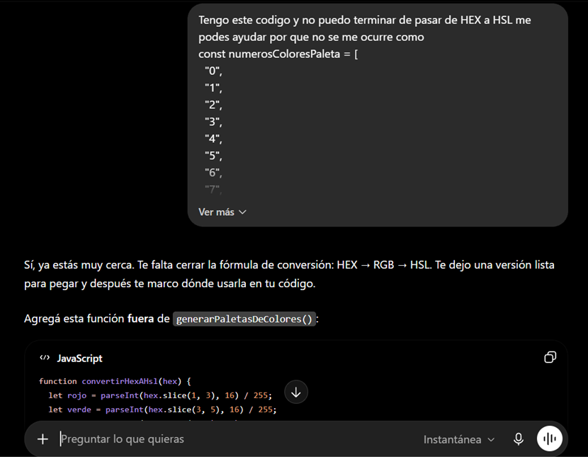
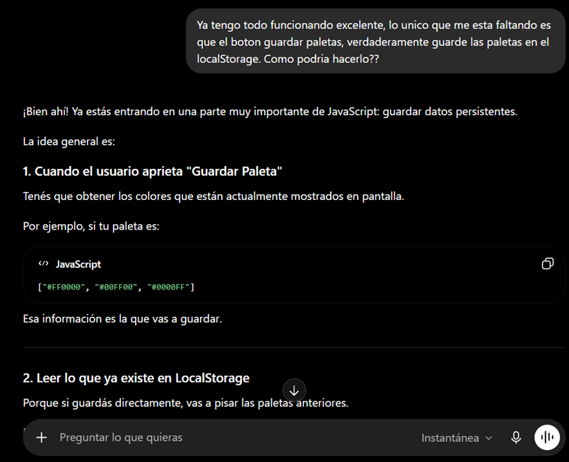
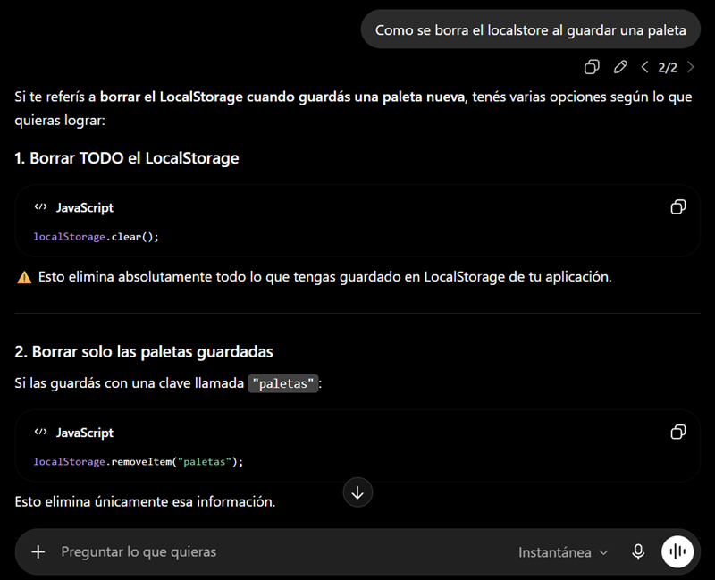

🤖 Prompts utilizados con IA y aprendizaje obtenido

Durante el desarrollo de ColorFly Studio utilicé inteligencia artificial como herramienta de apoyo para comprender conceptos de JavaScript y resolver problemas específicos del proyecto. Los prompts no fueron utilizados para copiar soluciones completas, sino como guía para entender la lógica detrás de cada funcionalidad.

🎨 Conversión de colores HEX a HSL

Uno de los desafíos fue permitir que el usuario pudiera visualizar los colores tanto en formato HEX como en formato HSL. Para ello utilicé un prompt orientado a comprender cómo convertir un color hexadecimal a HSL utilizando JavaScript.

A partir de la explicación obtenida pude entender el proceso de conversión:

Conversión de HEX a RGB.
Normalización de los valores RGB.
Cálculo de Matiz (Hue).
Cálculo de Saturación (Saturation).
Cálculo de Luminosidad (Lightness).

Este aprendizaje me permitió implementar el cambio dinámico entre ambos formatos dentro de la aplicación.

💾 Guardado de paletas en LocalStorage

Otro requerimiento importante fue lograr que las paletas generadas pudieran guardarse para ser reutilizadas posteriormente.

Mediante prompts enfocados en LocalStorage aprendí a:

Obtener los colores actualmente mostrados.
Convertir la información a formato JSON.
Guardar múltiples paletas sin sobrescribir las anteriores.
Recuperar las paletas almacenadas.
Mostrar dinámicamente las paletas guardadas mediante botones generados con JavaScript.

Gracias a esto la aplicación permite almacenar y reutilizar paletas favoritas incluso después de generar nuevas combinaciones.

🗑️ Gestión y limpieza del LocalStorage

Durante el desarrollo también surgió la necesidad de controlar cuándo conservar información y cuándo eliminarla.

A través de distintos prompts investigué:

Cómo eliminar una clave específica mediante localStorage.removeItem().
Cómo vaciar completamente el almacenamiento utilizando localStorage.clear().
Cuándo conviene conservar información persistente y cuándo reiniciar el estado de la aplicación.

Este proceso me ayudó a comprender mejor el manejo de datos persistentes en aplicaciones Front-End y a tomar decisiones sobre la experiencia de usuario.

📚 Aprendizajes obtenidos

Gracias a estos ejercicios pude profundizar conocimientos sobre:

Manipulación del DOM.
Eventos en JavaScript.
Arrays y objetos.
LocalStorage.
Clipboard API.
Conversión de espacios de color.
Generación dinámica de elementos HTML.
Persistencia de datos en aplicaciones Front-End.
Resolución de problemas utilizando IA como herramienta de aprendizaje.
